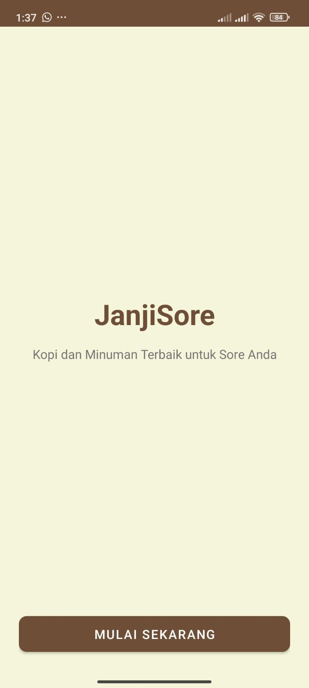
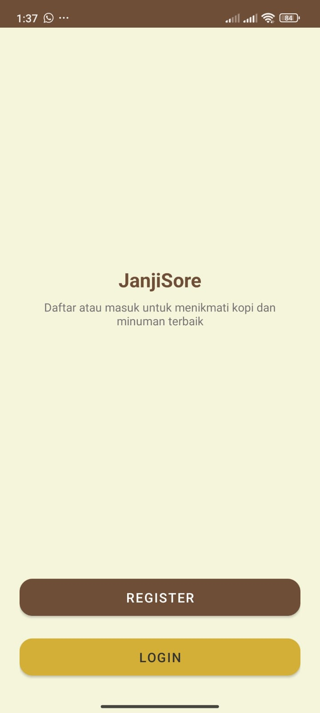
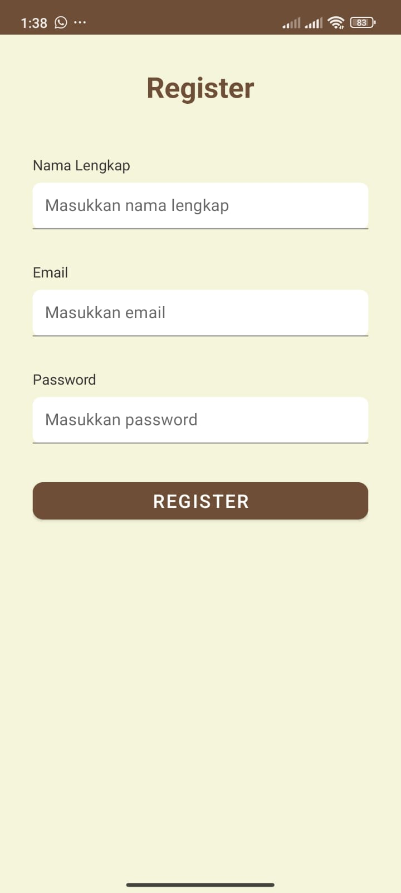
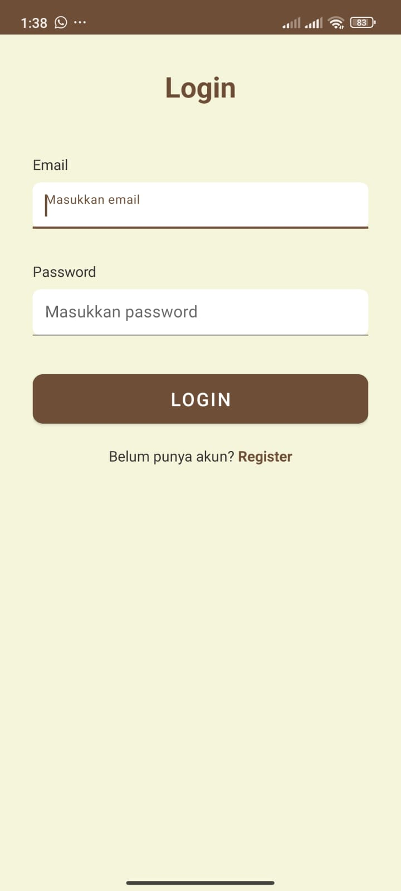
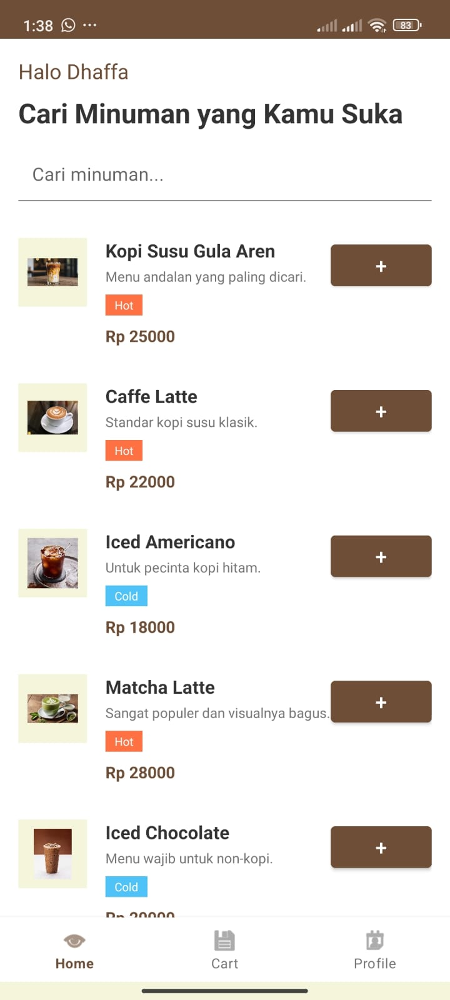
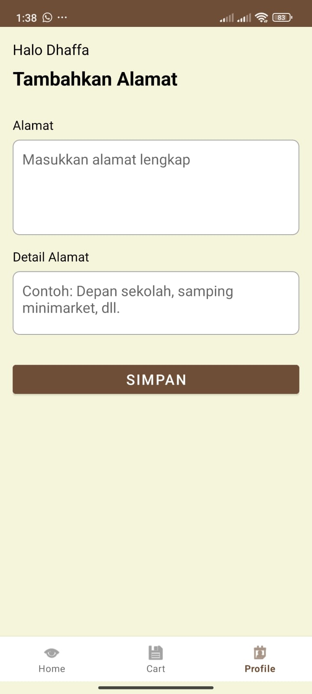
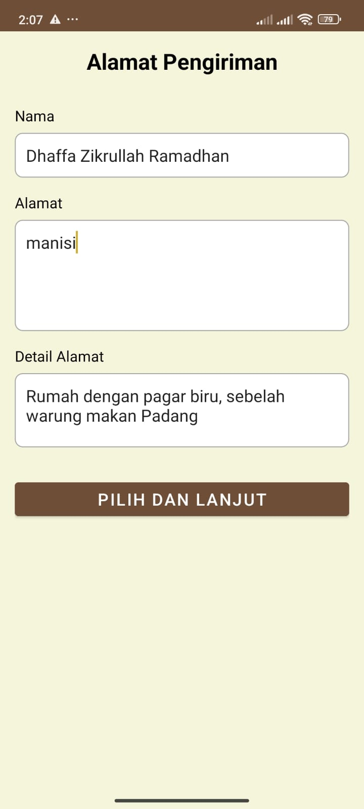
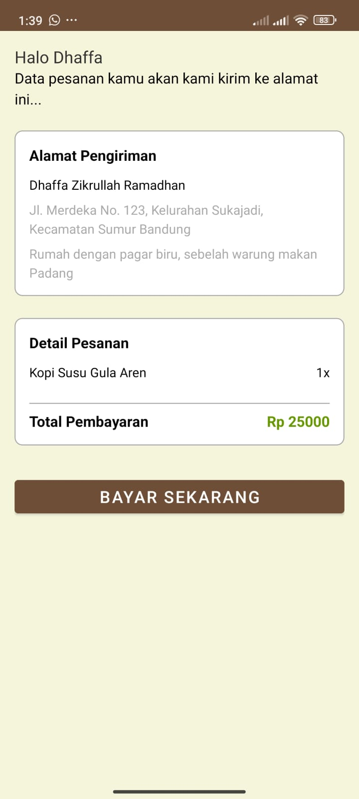
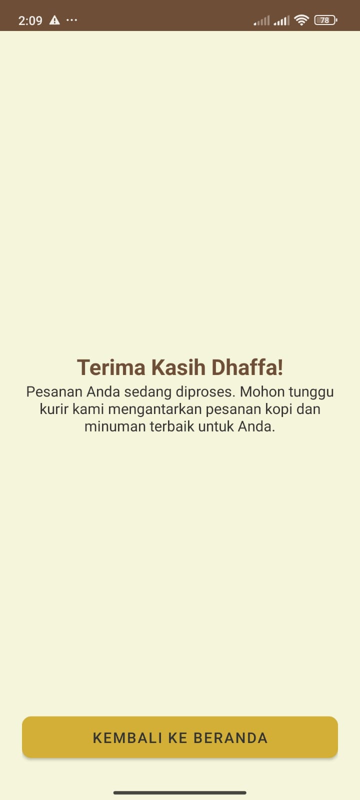

# JanjiSore - Aplikasi Pemesanan Minuman

Selamat datang di repositori JanjiSore! Ini adalah proyek aplikasi mobile Android yang dibangun menggunakan **Kotlin**. Aplikasi ini berfungsi sebagai platform sederhana untuk melihat menu dan memesan minuman kopi serta non-kopi

---

## ☕ Tentang Aplikasi

JanjiSore adalah solusi mobile sederhana bagi pengguna yang ingin memesan minuman favorit mereka dengan mudah. Aplikasi ini menampilkan katalog produk, mengelola autentikasi pengguna, dan memfasilitasi proses pemesanan dari awal hingga selesai

---

## ✨ Fitur Utama

Aplikasi ini memiliki beberapa fitur inti:

* **Autentikasi Pengguna:** Alur lengkap untuk **Login** dan **Register** pengguna
* **Katalog Menu:** Menampilkan daftar lengkap minuman kopi dan non-kopi yang tersedia
* **Manajemen Profil:** Pengguna dapat melihat dan mengelola data profil mereka
* **Proses Pemesanan:** Alur checkout lengkap, termasuk pemilihan alamat pengiriman
* **Desain Minimalis:** Antarmuka yang bersih dan mudah digunakan

---

## 🚀 Teknologi yang Digunakan

* **Bahasa Pemrograman:** [Kotlin](https://kotlinlang.org/)
* **Platform:** Android Native
* **UI:** (Tulis di sini apakah Anda menggunakan XML Layouts atau Jetpack Compose)

---

## 📸 Tampilan Aplikasi (Screenshots)

Berikut adalah beberapa tampilan dari alur aplikasi JanjiSore

<table align="center">
  <tr>
    <td align="center">
      <strong>Halaman Utama</strong><br>
      
    </td>
    <td align="center">
      <strong>Pilihan Login/Register</strong><br>
      
    </td>
    <td align="center">
      <strong>Halaman Register</strong><br>
      
    </td>
  </tr>
  <tr>
    <td align="center">
      <strong>Halaman Login</strong><br>
      
    </td>
    <td align="center">
      <strong>Halaman Menu</strong><br>
      
    </td>
    <td align="center">
      <strong>Halaman Profil</strong><br>
      
    </td>
  </tr>
  <tr>
    <td align="center">
      <strong>Alamat Pengiriman</strong><br>
      
    </td>
    <td align="center">
      <strong>Halaman Checkout</strong><br>
      
    </td>
    <td align="center">
      <strong>Pemesanan Sukses</strong><br>
      
    </td>
  </tr>
</table>

---

## ⚙️ Cara Menjalankan Proyek

Jika Anda ingin berkontribusi atau sekadar mencoba aplikasi ini, ikuti langkah-langkah berikut:

1.  **Clone repositori**
    ```bash
    git clone [https://github.com/dazidhan/JanjiSore.git](https://github.com/dazidhan/JanjiSore.git)
    ```
2.  **Buka Proyek**
    Buka proyek ini menggunakan [Android Studio](https://developer.android.com/studio)
3.  **Sync Gradle**
    Tunggu hingga Android Studio selesai mengunduh semua dependensi yang diperlukan (Gradle Sync)
4.  **Jalankan Aplikasi**
    Pilih emulator atau perangkat Android fisik Anda, lalu tekan tombol 'Run'

---

## 👤 Kontributor

* **[dazidhan](https://github.com/dazidhan)** - Pengembang Utama


